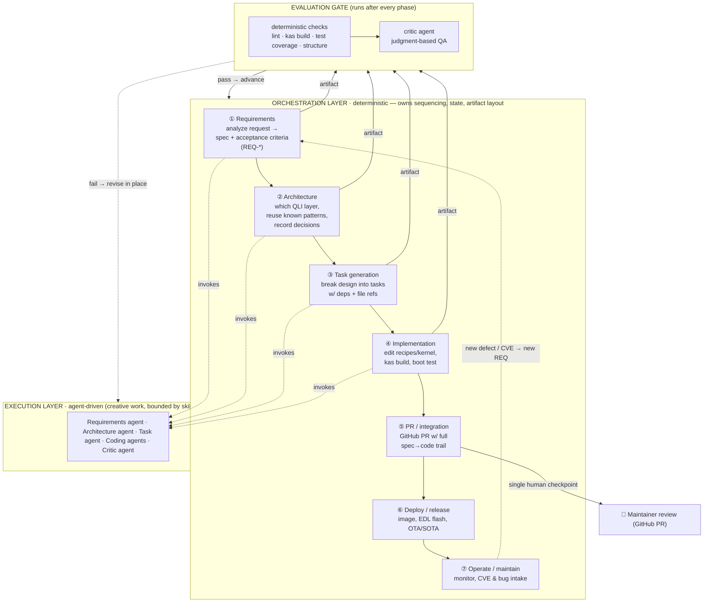
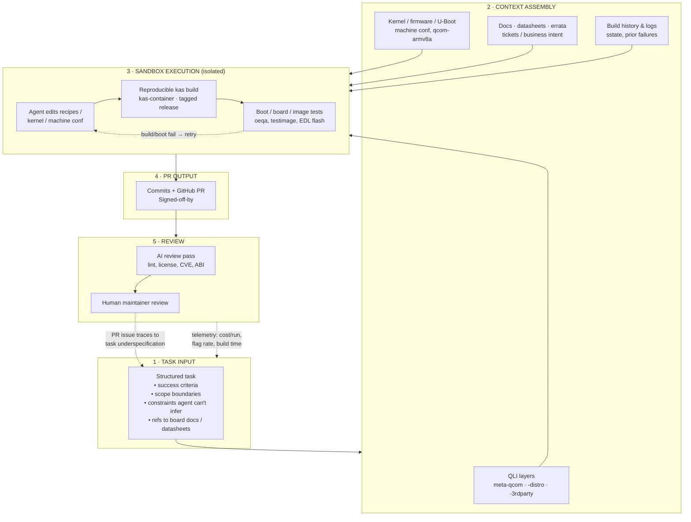

# Agentic Workflow for Linux System Development

This page describes how to structure an **agentic coding workflow** (an AI
coding agent producing reviewable commits/PRs) for embedded Linux / Yocto system
development, using **Qualcomm Linux (QLI)** — the `meta-qcom` layer stack — as
the concrete target. It draws on two sources and adapts both to the realities of
BSP, kernel, and distro work (reproducible builds, boot/image tests, license/CVE
compliance):

- the five-phase **delivery pipeline** from
  [codegen.com](https://codegen.com/how-to-build-agentic-coding-workflows/) —
  task input → context → sandbox → PR → review; and
- the phased **software development life cycle** with a deterministic
  orchestrator from QuantumBlack's
  [Agentic Workflows for Software Development](https://medium.com/quantumblack/agentic-workflows-for-software-development-dc8e64f4a79d)
  — requirements → architecture → tasks → implementation, gated by evaluations.

The core lesson shared by both: **agentic workflows fail at a predictable point,
and it is not the model.** codegen frames the bottleneck as upstream context
preparation (a vague task produces a vague PR); QuantumBlack frames it as
orchestration — _"agents shouldn't decide what comes next or where artifacts
should live."_ Structure the lifecycle deterministically, let agents do the
creative work inside each bounded phase.

## The Qualcomm Linux (QLI) layer stack

QLI is delivered as a small stack of OpenEmbedded layers built with
[kas](https://github.com/siemens/kas). The agent operates on these layers:

| Layer                                                                        | Role                                                                                |
| ---------------------------------------------------------------------------- | ----------------------------------------------------------------------------------- |
| [`meta-qcom`](https://github.com/qualcomm-linux/meta-qcom)                   | Hardware enablement (BSP): machines, kernel, firmware, U-Boot                       |
| [`meta-qcom-distro`](https://github.com/qualcomm-linux/meta-qcom-distro)     | Reference distro config + images (connectivity, multimedia, graphics, ML, security) |
| [`meta-qcom-3rdparty`](https://github.com/qualcomm-linux/meta-qcom-3rdparty) | Third-party-maintained Qualcomm boards (depends on `meta-qcom`)                     |
| `openembedded-core` (+ `meta-openembedded`)                                  | Upstream base (required; `meta-oe` optional)                                        |

- **Generic machine** `qcom-armv8a` covers contemporary boards uniformly;
  per-board specifics live in extension files. Real CI targets include
  `qcs6490-rb3gen2`, `qcm6490-idp`, `qcs615-ride`, `qcs8300-ride-sx`,
  `qcs9100-ride-sx`, `qrb2210-rb1`, `sdx75-idp`, `sm8750-mtp`, and the
  Dragonwing `iq-*-evk` EVKs.
- **Branches / releases**: `master`/`main` (latest Yocto), `wrynose` (QLI 2.x,
  Yocto 6.0 LTS), `scarthgap` (QLI ≥1.4, Yocto 5.0 LTS), `kirkstone` (QLI ≤1.3).
  QLI releases are tagged for reproducible builds.
- **Build** (sandbox): `kas-container build meta-qcom/ci/<board>.yml`.
- **Flash**: images flash over USB in EDL mode.
- **Contribution**: GitHub pull requests against `master`/`main` (open issues
  for stable branches), following Yocto submission guidelines with
  `Signed-off-by`.

## General end-to-end development lifecycle

The broadest view is a full SDLC where a **deterministic orchestrator** drives
phase transitions and **specialized agents** do the work inside each phase. Each
phase emits an artifact (with machine-readable frontmatter: id, status,
dependencies) and must pass an **evaluation gate** — automated deterministic
checks _plus_ a critic agent — before the orchestrator advances. Humans enter at
a single checkpoint: when the PR opens with the complete change.



Mapping the two source models onto this lifecycle:

| Lifecycle phase      | codegen pipeline       | QuantumBlack SDLC | QLI artifact / action                                                                                    |
| -------------------- | ---------------------- | ----------------- | -------------------------------------------------------------------------------------------------------- |
| ① Requirements       | Task input             | Requirements      | `REQ-*` spec: target board (`qcs6490-rb3gen2`…), scope, constraints, datasheet refs                      |
| ② Architecture       | (context)              | Architecture      | which layer — `meta-qcom` (BSP) vs `meta-qcom-distro` vs `meta-qcom-3rdparty`; machine `.conf` decisions |
| ③ Task generation    | (context)              | Task generation   | per-recipe / per-`.bbappend` tasks with deps                                                             |
| ④ Implementation     | Context + sandbox exec | Implementation    | edits + `kas-container build meta-qcom/ci/<board>.yml` + boot/oeqa test                                  |
| ⑤ PR / integration   | PR output + review     | PR (human entry)  | `Signed-off-by` commits, GitHub PR, AI + maintainer review                                               |
| ⑥ Deploy / release   | —                      | —                 | build `qcom-console-image` / `qcom-multimedia-image`, EDL flash, tagged QLI release                      |
| ⑦ Operate / maintain | —                      | —                 | CVE/bug intake feeding the next `REQ-*`                                                                  |

Phases ⑥–⑦ extend beyond what either article details (both stop at PR delivery),
but they close the loop for a shipping embedded distro.

### Why the orchestrator is deterministic

The split is deliberate: agents are good at the _creative_ work inside a phase
but should not own _sequencing_. A rules-based engine manages phase transitions,
dependency tracking, and where artifacts live; agents are invoked into bounded
phases and guided by skills and templates. This mirrors a waterfall structure on
purpose — and gets away with it because an agent can run the full requirements →
architecture → tasks → implementation cycle in hours, not months, so the
up-front structure is affordable.

### Artifacts and traceability

Every phase writes a convention-based artifact carrying machine-readable
frontmatter (`id`, `status`, `dependencies`) so the engine can validate
completeness and enforce ordering. A representative layout:

```
.sdlc/context/             persistent project knowledge (QLI layers, board quirks, conventions)
.sdlc/specs/REQ-*          feature specs, architecture decisions, generated tasks
meta-qcom*/ · ci/*.yml     the actual recipes, machine conf, and kas targets that get edited
```

The payoff is a continuous spec→code trail: the PR at phase ⑤ links back through
tasks, architecture, and the originating requirement.

## The five phases (delivery pipeline zoom-in)

Zooming into implementation → review — the codegen.com delivery pipeline:



ASCII fallback (for terminals without Mermaid rendering):

```
 (1) TASK INPUT ─► (2) CONTEXT ─────► (3) SANDBOX ──► (4) PR ──► (5) REVIEW
 success criteria   QLI layers         edit             commits   AI pass
 scope/constraints  kernel/fw/conf      kas build        +PR       + human
 board doc refs     docs/tickets        boot/EDL test              maintainer
       ▲            build logs            │  ▲                         │
       │                                  └──┘ fail→retry             │
       └──────── "PR issue = task underspecification" ◄───────────────┘
       └──────── telemetry: cost/run · flag rate · build time ◄───────┘
```

## How each phase maps to QLI

| Phase                     | QLI-specific specifics                                                                                                                                                                                                                       |
| ------------------------- | -------------------------------------------------------------------------------------------------------------------------------------------------------------------------------------------------------------------------------------------- |
| **1 · Task input**        | State success criteria, the affected board (`ci/<board>.yml`), the scope (which of `meta-qcom` / `meta-qcom-distro` / `meta-qcom-3rdparty`), and constraints the agent cannot infer (ABI, license, SoC quirks). Reference datasheets/errata. |
| **2 · Context assembly**  | The active layers, recipes/`.bbappend`s, kernel + firmware + U-Boot, machine conf (`qcom-armv8a` + board extension), and **prior kas/build logs / sstate** — failures often live in the logs.                                                |
| **3 · Sandbox execution** | `kas-container build meta-qcom/ci/<board>.yml` pinned to a tagged QLI release so the run is reproducible. "Tests" are oeqa `testimage` and on-target boot (EDL flash), not unit tests.                                                       |
| **4 · PR output**         | Commits carry `Signed-off-by`; submitted as GitHub pull requests against `master`/`main` per Yocto submission guidelines.                                                                                                                    |
| **5 · Review**            | AI pass covers lint, **license compliance, CVE/CRA scanning, kernel/lib ABI**; then a Qualcomm/community maintainer reviews on GitHub.                                                                                                       |

## Where agents excel vs. struggle

**Strong candidates** (clear patterns, verifiable outcome):

- Recipe version bumps and layer/branch updates (`scarthgap` → `wrynose`)
- Migrations following a defined pattern across recipes
- CVE backports that ship with a reproducer
- defconfig / `.bbappend` boilerplate and documentation generation

**Poor candidates** (need judgment or move underneath the agent):

- Cross-cutting BSP bring-up touching many layers / a new SoC at once
- Architectural distro decisions (image feature sets, init, security policy)
- Evolving hardware specs where the target board is still moving

## Feedback loops to instrument

1. **Build/boot failure → retry** inside the sandbox before any PR is opened.
2. **PR defects trace upstream**: a flagged PR almost always means the task was
   underspecified — fix the task template, not just the diff.
3. **Telemetry**: track cost per build, PR flag rate, and wall-clock build time
   to tell whether task structure (not the model) is the limiting factor.

## Driving this with QLI (kas)

The QLI build flow fits phase 3 (reproducible sandbox execution) directly:

```bash
# Build a board image inside the kas container (reproducible, pinned)
kas-container build meta-qcom/ci/qcs6490-rb3gen2.yml

# Distro / image variants are composed from additional ci/*.yml fragments,
# e.g. qcom-distro.yml, qcom-distro-multimedia-image.yml
```

Pin to a tagged QLI release (or an LTS branch such as `wrynose` for QLI 2.x) so
the agent's sandbox is byte-reproducible. Keep each task scoped to one layer and
one board so the build, boot test, and review stay fast and the feedback loops
above stay tight.
