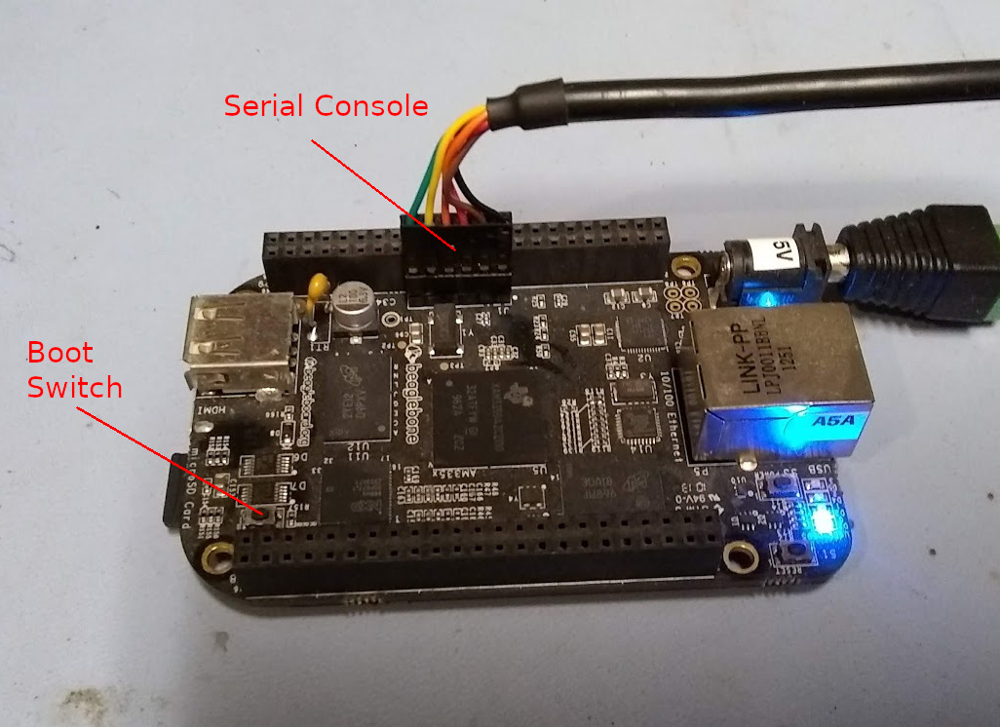

# Notes on using Yoe on the BeagleBone Black

[up](README.md)

[BSP Layer README](https://github.com/YoeDistro/meta-ti/blob/master/README)

[BeagleBone Black system reference manual](https://github.com/beagleboard/beaglebone-black/wiki/System-Reference-Manual)

## Building/installing an image

1. `git clone git://github.com/YoeDistro/yoe-distro.git`
1. `cd yoe-distro`
1. `. beaglebone-envsetup.sh`
1. `yoe_setup`
1. `bitbake core-image-base`
1. insert SD card
1. `lsblk` (note sd card device, and substitute for /dev/sdX below)
1. `yoe_install_image /dev/sdX core-image-base`
1. `sudo eject /dev/sdX`
1. connect serial console (instructions below)
1. install SD card in a BeagleBone
1. hold the boot switch, apply power, and BeagleBone will now boot from SD card

## Connecting to serial console

The BeagleBone Black serial console is available on a 6-pin header as shown in the image
below. The pinout matches a standard [3.3V FTDI 6-pin connector](https://www.ftdichip.com/Support/Documents/DataSheets/Cables/DS_TTL-232R_CABLES.pdf).

