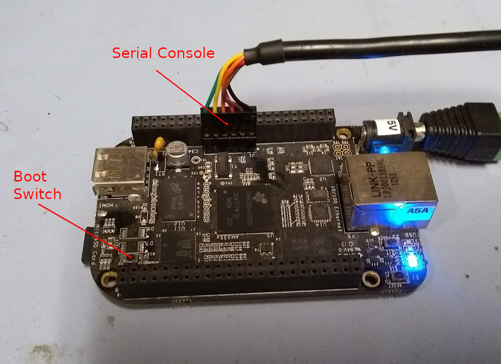

# BeagleBone Black

[BSP Layer README](https://github.com/YoeDistro/meta-ti/blob/master/README)

[BeagleBone Black system reference manual](https://github.com/beagleboard/beaglebone-black/wiki/System-Reference-Manual)

## Building/installing an image

1. `git clone --recurse-submodules -j8 -b master https://github.com/YoeDistro/yoe-distro.git yoe`
1. `cd yoe`
1. `kas build kas/beaglebone.yml`
1. Insert SD card
1. `lsblk` (note SD card device, and substitute for /dev/sdX below)
1. Flash the image from `build/tmp/deploy/images/` to the SD card (e.g. using
   [Etcher](https://etcher.balena.io/))
1. `sudo eject /dev/sdX`
1. Connect serial console (instructions below)
1. Install SD card in a BeagleBone
1. Hold the boot switch, apply power, and the BeagleBone will boot from the SD
   card and install Yoe to the eMMC flash
1. Remove power and SD card. Yoe should now boot from eMMC.

## Serial Console

The BeagleBone Black serial console is available on a 6-pin header as shown in
the image below. The pinout matches a standard
[3.3V FTDI 6-pin connector](https://www.ftdichip.com/Support/Documents/DataSheets/Cables/DS_TTL-232R_CABLES.pdf).

