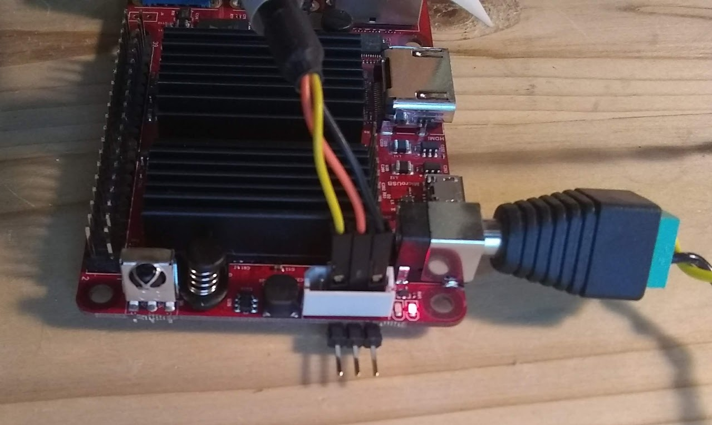
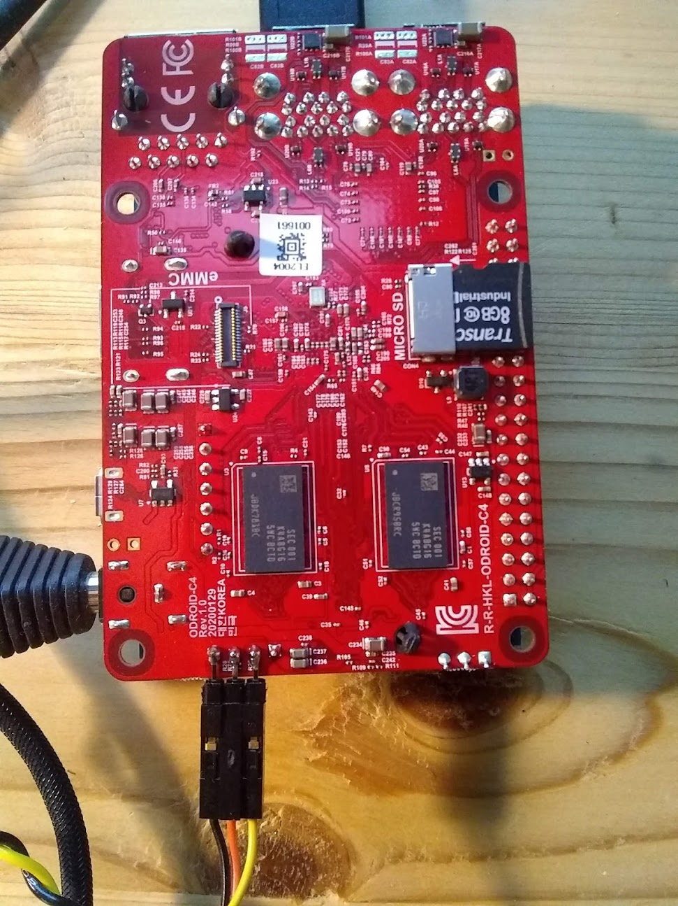

# ODROID

Yoe supports various Odroid boards.

## Serial console connection

Although ODROID provides a
[serial console adapter](https://wiki.odroid.com/accessory/development/usb_uart_kit),
many of us have rPI style flying lead cables on hand. These can be attached
directly to the connector on the ODROID. If you have a HAT on the the board,
then an option is to solder a small header on the bottom as shown below.

