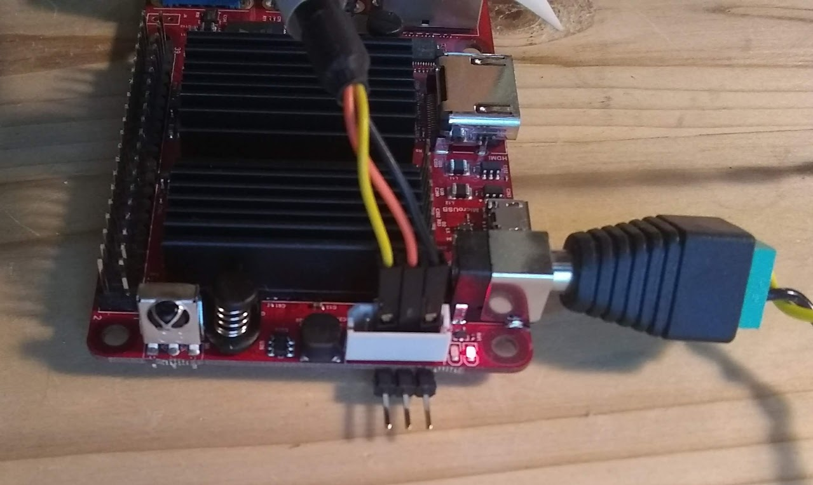
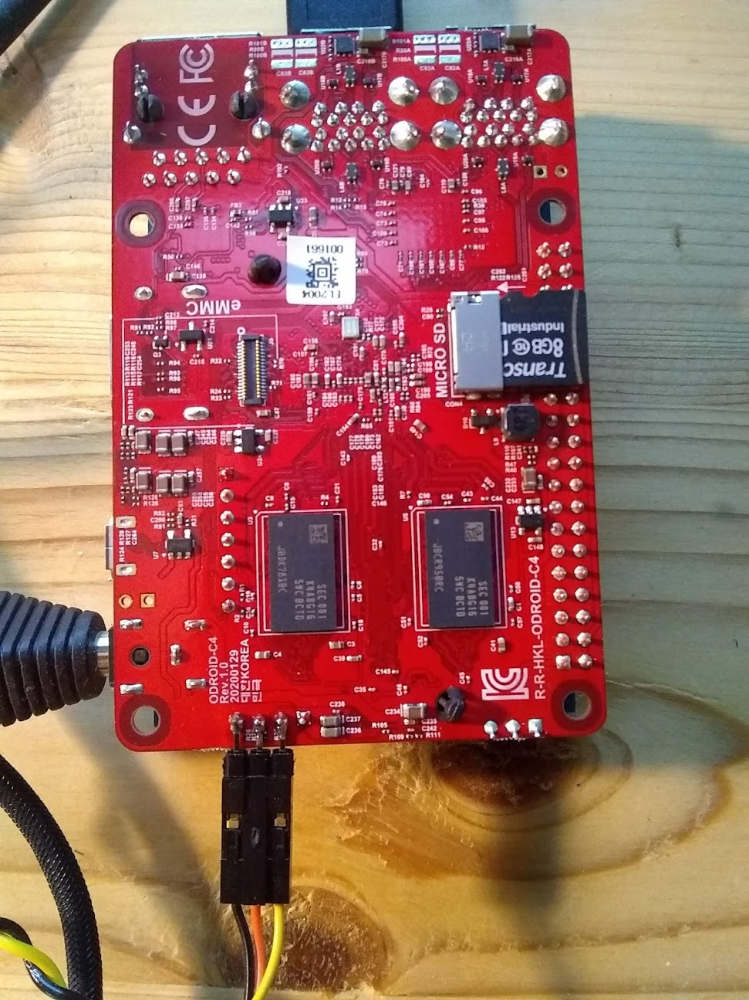

# ODROID C4

The [ODROID-C4](https://wiki.odroid.com/odroid-c4/odroid-c4) is a single-board
computer from Hardkernel powered by the Amlogic S905X3 SoC. It offers a compact
form factor with capable processing power at a low price point.

## Key Features

- Amlogic S905X3: quad Cortex-A55 at up to 1.9 GHz
- Mali-G31 MP2 GPU
- 4 GB DDR4 RAM
- eMMC module socket and MicroSD card slot
- Gigabit Ethernet
- 4x USB 3.0, 1x USB 2.0 OTG
- HDMI 2.0 (up to 4K@60)
- 40-pin GPIO header
- IR receiver

## Building/installing an image

1. `git clone --recurse-submodules -j8 -b master https://github.com/YoeDistro/yoe-distro.git yoe`
1. `cd yoe`
1. `kas build kas/odroid-c4.yml`
1. Insert SD card
1. `lsblk` (note SD card device, and substitute for /dev/sdX below)
1. Flash the image from `build/tmp/deploy/images/` to the SD card
1. `sudo eject /dev/sdX`
1. Install SD card in the ODROID-C4 and apply power

## Serial Console

The debug UART is available on the 40-pin GPIO header. Connect a 3.3V
USB-to-serial adapter:

- Pin 6 (GND) to GND
- Pin 8 (TX) to RX
- Pin 10 (RX) to TX

Serial settings: 115200 baud, 8N1.

Although ODROID provides a
[serial console adapter](https://wiki.odroid.com/accessory/development/usb_uart_kit),
many of us have rPi-style flying-lead cables on hand. These can be attached
directly to the connector on the ODROID. If you have a HAT on the board, then an
option is to solder a small header on the bottom as shown below.

## References

- [ODROID-C4 Wiki](https://wiki.odroid.com/odroid-c4/odroid-c4)
- [meta-odroid BSP Layer](https://github.com/nicholasjng/meta-odroid)
