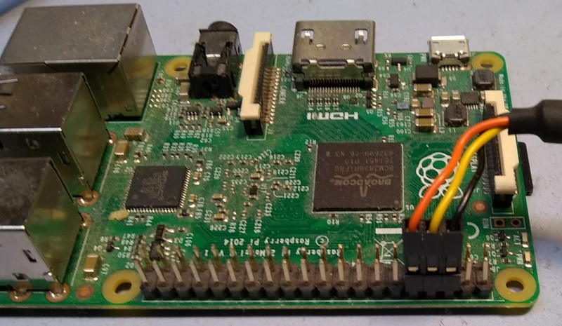

# Notes on using Yoe on the Raspberry PI

[up](README.md)

[BSP Layer documentation](https://github.com/YoeDistro/meta-raspberrypi/blob/master/docs)

## Building/installing an image

1. `git clone git://github.com/YoeDistro/yoe-distro.git`
1. `cd yoe-distro`
1. `. raspberrypi3-64-envsetup.sh`
1. `yoe_setup`
1. `bitbake yoe-simple-image`
1. insert SD card
1. `lsblk` (note sd card device, and substitute for /dev/sdX below)
1. `yoe_install_image /dev/sdX yoe-simple-image`
1. optional: configure console for serial port (see below)
1. `sudo eject /dev/sdX`
1. Install SD card in a Raspberry PI and enjoy your new image

Other Raspberry Pi variants can be built by sourcing the appropriate envsetup
file.

## Enable serial console

The serial console for the rPI3 can be enabled by adding `ENABLE_UART = "1"` to
local.conf. This is currently done in local.conf, but has tradeoffs as described
in the BSP layer
[documentation](https://github.com/YoeDistro/meta-raspberrypi/blob/master/docs/extra-build-config.md).

## Connecting to rPI serial console

The Raspberry PI serial console is avaiable on the expansion header. A
USB->serial cable with flying leads is a convenient way to connect to this.
[FTDI](https://www.ftdichip.com/Products/Cables/RPi.htm) (as well as many other
companies supply these cables). The below image shows how the FTDI cable is
connected:

The relevant signals are:

- FTDI Black (GND) <-> rPI Pin 6 (GND)
- FTDI Yellow (RXD) <- rPI Pin8 (TXD)
- FTDI Orange (TXD) -> rPI Pin10 (RXD)

See the
[schematics](https://www.raspberrypi.org/documentation/hardware/raspberrypi/schematics/README.md)
for more information.

## rPI Power Supply

Some of the Raspberry PI products seem to be sensitive to power quality. It is
recommended to use a supply that outputs 5.1V such as the
[official supply](https://www.raspberrypi.org/products/raspberry-pi-universal-power-supply/).
An inadequate supply may result in lockups or SD card file system corruption.
