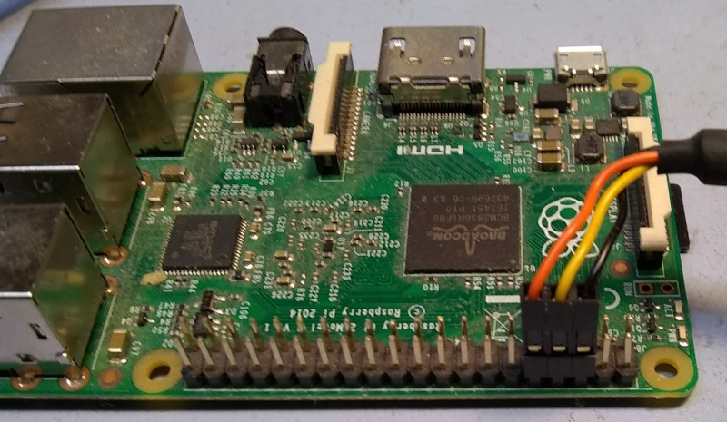

# Raspberry Pi

[BSP Layer documentation](https://github.com/YoeDistro/meta-raspberrypi/blob/master/docs)

Yoe supports the following Raspberry Pi projects:

| Project   | Board              | Architecture |
| --------- | ------------------ | ------------ |
| `rpi4-32` | Raspberry Pi 4     | 32-bit ARM   |
| `rpi4-64` | Raspberry Pi 4     | 64-bit ARM   |
| `rpi5`    | Raspberry Pi 5     | 64-bit ARM   |

## Raspberry Pi 5

The [Raspberry Pi 5](https://www.raspberrypi.com/products/raspberry-pi-5/) is
the latest generation featuring a Broadcom BCM2712 SoC with quad Cortex-A76
cores at 2.4 GHz, VideoCore VII GPU, and 4 or 8 GB LPDDR4X RAM. It adds a PCIe
2.0 x1 connector (for NVMe HATs), dual 4Kp60 HDMI output, and a dedicated UART
connector for the Raspberry Pi Debug Probe.

The Pi 5 requires a USB-C power supply capable of 5V/5A (25W) for full
performance. A 5V/3A supply will work but may throttle under load.

## Raspberry Pi 4

The [Raspberry Pi 4](https://www.raspberrypi.com/products/raspberry-pi-4-model-b/)
features a Broadcom BCM2711 SoC with quad Cortex-A72 cores at 1.8 GHz, up to
8 GB LPDDR4 RAM, dual micro-HDMI (4Kp60), Gigabit Ethernet, USB 3.0, and
dual-band WiFi. Both 32-bit (`rpi4-32`) and 64-bit (`rpi4-64`) builds are
supported.

## Building/installing an image

1. `git clone https://github.com/YoeDistro/yoe-distro.git`
1. `cd yoe-distro`
1. `. ./envsetup.sh <project>` (e.g., `rpi4-64`, `rpi5`)
1. `yoe_setup`
1. `bitbake yoe-simple-image`
1. Insert SD card
1. `lsblk` (note SD card device, and substitute for /dev/sdX below)
1. `yoe_install_image /dev/sdX yoe-simple-image` (Note,
   [Etcher](https://www.balena.io/etcher/) can also be used to write images to
   SD cards).
1. Optional: configure console for serial port (see below)
1. `sudo eject /dev/sdX`
1. Install SD card in the Raspberry Pi and enjoy your new image

## Enable serial console

The serial console for the rPi3/4 can be enabled by adding `ENABLE_UART = "1"`
to local.conf. This is currently done in local.conf, but has tradeoffs as
described in the BSP layer
[documentation](https://github.com/YoeDistro/meta-raspberrypi/blob/master/docs/extra-build-config.md).

## Connecting to the serial console

The Raspberry Pi serial console is available on the 40-pin expansion header. A
USB-to-serial cable with flying leads is a convenient way to connect to this.
[FTDI](https://www.ftdichip.com/Products/Cables/RPi.htm) (as well as many other
companies) supply these cables. The below image shows how the FTDI cable is
connected:

The relevant signals are:

- FTDI Black (GND) <-> rPI Pin 6 (GND)
- FTDI Yellow (RXD) <- rPI Pin 8 (TXD)
- FTDI Orange (TXD) -> rPI Pin 10 (RXD)

On the Raspberry Pi 5, you can also use the dedicated 3-pin UART connector with
the official Raspberry Pi Debug Probe.

See the
[Raspberry Pi documentation](https://www.raspberrypi.com/documentation/computers/raspberry-pi.html)
for more information.

## Power Supply

Some Raspberry Pi products are sensitive to power quality. It is recommended to
use the official power supply for your model:

- **Pi 4**: 5.1V/3A USB-C supply
- **Pi 5**: 5V/5A (27W) USB-C supply for full performance

An inadequate supply may result in lockups or SD card file system corruption.

## References

- [Raspberry Pi Products](https://www.raspberrypi.com/products/)
- [Raspberry Pi Documentation](https://www.raspberrypi.com/documentation/)
- [meta-raspberrypi BSP Layer](https://github.com/YoeDistro/meta-raspberrypi)
