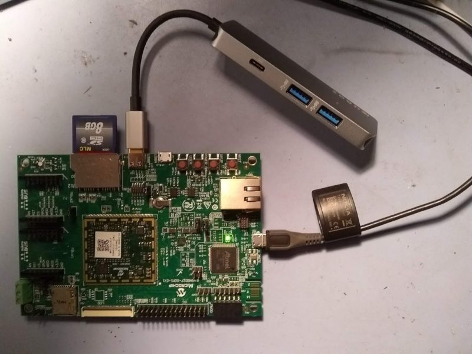

# ATSAMA5D27

The ATSAMA5D27 from Microchip is a ARM Cortex-A5 CPU available in 3 different
packages:

- [IC](https://www.microchip.com/wwwproducts/en/ATSAMA5D27)
- [SIP package with embedded SDRAM](https://www.microchip.com/wwwproducts/en/ATSAMA5D27C-D1G)
- [SOM package](https://www.microchip.com/wwwproducts/en/ATSAMA5D27-SOM1)

Microchip also provides a
[development board](https://www.microchip.com/DevelopmentTools/ProductDetails/ATSAMA5D27-SOM1-EK1).

## Building/installing an image

1. `git clone git://github.com/YoeDistro/yoe-distro.git`
1. `cd yoe-distro`
1. `. sama5d27-som1-ek-sd-envsetup.sh`
1. `yoe_setup`
1. `bitbake yoe-simple-image`
1. insert full size SD card (this image will not boot from the micro-sd slot)
1. `lsblk` (note sd card device, and substitute for /dev/sdX below)
1. `yoe_install_image /dev/sdX yoe-simple-image`
1. `sudo eject /dev/sdX`
1. Install SD card in development board and apply power via one of the micro-USB
   connectors.

## Connecting a serial console

The serial console for the development board is provided via the micro USB
connector near the Ethernet connector. The serial device will show up as
/dev/ttyACMx on a Linux system.

## USB Host

USB Host is provided by connecting a port expander to the USB Type-C connector,
as shown in the photo above.

## Bootstrapping the system using SAM-BA

[SAM-BA](https://github.com/atmelcorp/sam-ba) is a boot assistant that can be
used to bootstrap a system over a UART or USB Client port and program fuses. It
is possible to bootstrap a system completely over SAM-BA with no flash/eMMC/SD
memory programmed. This is useful for systems that perhaps have a eMMC flash
installed, but do not have a SD card slot. To bootstrap such a system, we can:

- Load both the AT91Bootstrap and u-boot over a UART or USBClient port, and then
  boot into u-boot using SAM-BA.
- From u-boot, we can load a kernel from a USB flash device, or from a TFTP
  server over the network.
- The kernel can mount a root file system on a USB disk, or use the Yoe updater
  to initialize and program a SD/eMMC device.

This process has been automated and described in more detail below:

1. build the target image first as described above
1. `yoe_sam_build_bootstrap_tools` (this builds SAM-BA and a special version of
   the at91bootstrap that can be used to load the bootloaders.
1. connect the development board USB (J10) to your workstation
1. make sure your linux user has access to serial ports (add to serial, uucp, or
   whatever group is used for serial ports)
1. make sure screen is installed (used for a serial terminal program)
1. power on the dev board and verify it is outputting ROMboot on the serial
   terminal: `screen /dev/ttyACM0 115200`
1. stop the serial terminal program (SAM-BA now needs to use the serial port):
   `Ctrl-A k`
1. `yoe_sam_load_uboot_via_samba` (this loads at91bootstrap and u-boot over a
   UART. Note, you must stop u-boot from launching a kernel, because there is no
   kernel to launch.)
1. you should now be sitting at a u-boot prompt
1. insert a USB flash disk into your workstation
1. `yoe_sam_install_bootstrap_files <USB disk mount point>` (this script copies
   the kernel and update file to a USB disk for installation)
1. insert USB flash disk into the development board host USB port
1. insert a blank SD card into the full size SD slot
1. from u-boot, load a kernel from USB:
   `usb reset;fatls usb 0:1;fatload usb 0:1 0x21000000 at91-sama5d27_som1_ek.dtb;fatload usb 0:1 0x22000000 zImage;bootz 0x22000000 - 0x21000000`

At this point the kernel will boot, run the updater from an initramfs bundled
with the kernel. The updater will inialize a SD/eMMC device, and program the
system from the \*.upd file on the USB disk.

See the [Yoe Updater Documentation](updater.md) for more information on how the
updater works.

You can also load a kernel from a TFTP server:

- `dhcp 0x21000000 <tftp server IP address>:at91-sama5d27_som1_ek.dtb`
- `dhcp 0x22000000 <tftp server IP address>:zImage`
- `bootz 0x22000000 - 0x21000000`
